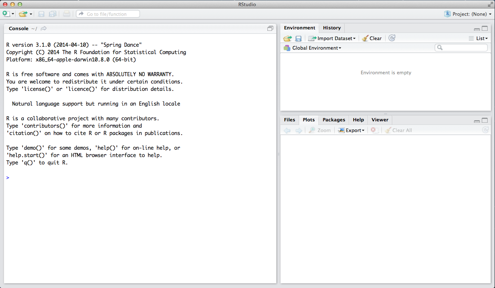

O objetivo deste laboratório é introduzir você ao R e ao RStudio, os programas que você 
utilizará ao longo do curso tanto para aprender os conceitos estatísticos discutidos no 
livro quanto para analisar dados reais e chegar a conclusões informadas. Para já distinguir 
qual é qual: R é o nome da linguagem de programação e RStudio é uma interface gráfica 
conveniente para utilizar o R.

À medida que os laboratório avançarem, você é encorajado a explorar além do que os 
laboratórios propõem; a vontade de experimentar o fará um programador muito melhor. 
Antes de chegarmos a esse estágio, contudo, você precisa desenvolver alguma fluência 
básica em R. Hoje nós começaremos com os blocos fundamentais do R e do RStudio: a 
interface, importação de dados, e comandos básicos.



O painel na parte superior-direita contém seu *espaço de trabalho* e também um histórico 
dos comandos que você utilizou anteriormente. Se você gerar um gráfico, ele aparecerá 
no painel do canto inferior direito.

O painel à esquerda é onde a ação acontece. Ele é chamado de *console*. Toda vez 
que você iniciar o RStudio, ele terá o mesmo texto no topo do console dizendo qual 
versão do R você está rodando. Abaixo dessa informação está o *comando de linha*. 
Como o nome sugere, ele interpreta qualquer entrada como um comando a ser executado. 
Inicialmente, a interação com o R é feita principalmente pela digitação de comandos e 
a interpretação dos resultados. Esses comandos e sua sintaxe evoluíram ao longo de décadas 
(literalmente) e agora proporcionam o que muitos usuários acreditam ser um forma bastante 
natural de acessar dados e organizar, descrever e invocar computações estatísticas.

Para iniciar, entre o seguinte comando no comando de linha do R (ou seja, logo depois 
do `>` no comando de linha). Você pode digitar o comando manualmente ou copiar e colar 
deste documento.

```{r load-abrbuthnot-data, eval=TRUE}
source("http://www.openintro.org/stat/data/arbuthnot.R")
```

Este comando instrui o R a acessar o website da OpenIntro e buscar alguns dados: 
a contagem de batismos de meninos e meninas coletada por Arbuthnot . Você deve 
ver que a área do espaço de trabalho no canto superior direito da janela do RStudio 
agora lista um conjunto de dados chamado `arbuthnot` que tem 82 observações 
de 3 variáveis. À medida que você interage com o R, você criará uma série de 
objetos. Às vezes você os carregará como nós fizemos aqui, e às vezes você os criará 
por conta própria como o produto de uma computação ou alguma análise que você realizou. 
Preste atenção que, por você estar acessando os dados a partir da internet, esse 
comando (e todas as tarefas) funcionará num laboratório de informática, na biblioteca, 
ou na sua casa; em qualquer lugar que você tenha acesso à internet.

## Os Dados: Registro de Batismos do Dr. Arbuthnot

O conjunto de dados Arbuthnot se refere ao Dr. John Arbuthnot, um médico, escritor 
e matemático do século 18. Ele se interessou pela razão de meninos e meninas 
recém-nascidos, e para isso ele coletou os registros de batismo de crianças nascidas 
em Londres durante todos os anos entre 1629 e 1710. Nós podemos dar uma olhada nos dados 
digitando seu nome no console.

```{r view-data, eval=FALSE}
arbuthnot
```

Você deve ver quatro colunas de números, com cada linha representando um ano 
diferente: a primeira entrada em cada linha é simplesmente o número da linha 
(um índice que podemos usar para acessar os dados de anos individuais, se quisermos), 
a segunda é o ano, e a terceira e a quarta são os números de meninos e meninas 
batizados naquele ano, respectivamente. Use a barra de rolagem à direita da 
janela do console para examinar o conjunto de dados completo.

Preste atenção que os números das linhas na primeira coluna não fazem parte dos 
dados de Arbuthnot. O R os adiciona como parte das impressões em tela para ajudá-lo 
a fazer comparações visuais. Pense neles como um índice que costuma ficar no lado 
esquerdo de uma planilha. A comparação com uma planilha geralmente será útil, de 
fato. O R armazenou os dados de Arbuthnot em um tipo de planilha ou tabela chamada 
de *data frame* ou *banco de dados*.

Você pode ver as dimensões deste banco de dados digitando:

```{r dim-data, eval=TRUE}
dim(arbuthnot)
```

Este comando deve dar como resposta `[1] 82 3`, indicando que há 82 linhas e 3 
colunas (nós já voltaremos ao que o `[1]` quer dizer), da mesma forma como está 
especificado ao lado do objeto em seu espaço de trabalho. Você pode ver os nomes 
das colunas (ou variáveis) digitando:

```{r names-data, eval=TRUE}
names(arbuthnot)
```

Você deve ver que o banco de dados contém as colunas `year` (ano),  `boys` 
(meninos), e `girls` (meninas). A essa altura, você deve ter notado que 
muitos dos comandos do R se parecem com funções matemáticas; ou seja, invocar 
comandos do R significa passar a uma função um certo número de argumentos. Os comandos 
`dim` e `names`, por exemplo, precisaram de um único argumento cada 
um: o nome do banco de dados.

One advantage of RStudio is that it comes with a built-in data viewer. Click on
the name `arbuthnot` in the *Environment* pane (upper right window) that lists 
the objects in your workspace. This will bring up an alternative display of the 
data set in the *Data Viewer* (upper left window). You can close the data viewer
by clicking on the *x* in the upper lefthand corner.

Uma vantagem do RStudio é que ele vem com um visualizador de dados embutido. 
Clique no nome `arbuthnot` no painel *Environment* (Ambiente), no canto superior 
direito da janela que lista os objetos em seu espaço de trabalho. Isso fará 
com que uma visualização alternativa do conjunto de dados apareça no *Data Viewer* 
(Visualizados de Dados), na janela superior esquerda. Você pode fechar o 
visualizador de dados clicando no *x* no canto superior esquerdo.

## Explorando

Let's start to examine the data a little more closely. We can access the data in
a single column of a data frame separately using a command like

Vamos começar a examinar os dados um pouco mais de perto. Podemos acessar 
separadamente os dados de uma única coluna da base de dados usando um comando como

```{r view-boys, eval=FALSE}
arbuthnot$boys
```

Este comando mostrará somente o número de meninos batizados em cada ano.

1.  Qual comando você utilizaria para extrair somente a contagem de meninas 
    batizadas? Experimente!

Preste atenção que a maneira como o R imprimiu esses dados é diferente. Quando 
nós visualizamos o banco de dados completo, vimos 82 linhas, uma em cada linha 
do console. Esses dados não estão mais estruturados em uma tabela com outras 
variáveis, então eles são dispostos um ao lado do outro. Objetos que são impressos 
na tela desta maneira são chamados de *vetores*; eles representam um conjunto 
de números. O R adicionou números em [colchetes] no lado esquerdo dos resultados 
para indicar localizações dentro do vetor. Por exemplo, `5218` segue `[1]`, indicando 
que `5218` é a primeira entrada no vetor. E se `[43]` inicia uma linha, então 
isso significa que o primeiro número naquela linha representa o 43<sup>o</sup> 
elemento no vetor.

O R tem algumas funções poderosas para criar gráficos. Podemos criar uma gráfico 
simples do número de meninas batizadas por ano com o comando

```{r plot-girls-vs-year, eval=FALSE}
plot(x = arbuthnot$year, y = arbuthnot$girls)
```

Por padrão, o R cria uma gráfico de dispersão com cada par x, y indicado por um 
círculo aberto. O gráfico deve aparecer sob a aba *Plots* (Gráficos) no canto inferior direito 
do RStudio. Repare que o comando acima também se parece com uma função, desta vez 
com dois argumentos separados por vírgula. O primeiro argumento na função de 
gráfico especifica a variável para o eixo x e o segundo para o eixo y. Se nós 
quiséssemos conectar os pontos dos dados com linhas, nós poderíamos adicionar um 
terceiro argumento, a letra `l` de **l**inha.

```{r plot-girls-vs-year-line, eval=FALSE}
plot(x = arbuthnot$year, y = arbuthnot$girls, type = "l")
```

Você pode se perguntar como você poderia saber que era possível adicionar aquele 
terceiro argumento. Felizmente, o R tem documentações detalhadas de todas as suas 
funções. Para ler o que uma função faz e aprender quais os argumentos disponíveis, basta 
digitar um ponto de interrogação seguido pelo nome da função na qual vocês está 
interessado. Tente o seguinte.

```{r plot-help, eval=FALSE, tidy = FALSE}
?plot
```

Veja que o arquivo de ajuda substitui o gráfico no painel no canto inferior 
direito. Você pode alternar entre gráficos e arquivos de ajuda usando as abas 
no topo daquele painel.

2.  Há alguma tendência aparente no número de meninas batizadas ao longo dos anos? 
    Como você a descreveria?

Now, suppose we want to plot the total number of baptisms.  To compute this, we 
could use the fact that R is really just a big calculator. We can type in 
mathematical expressions like

Agora, vamos supôr que queiramos fazer um gráfico com o número total de batismos. 
Para calcular isso, nós podemos nos aproveitar do fato de que o R é, na verdade, 
uma grande calculadora. Nós podemos digitar expressões matemáticas como

```{r calc-total-bapt-numbers, eval=FALSE}
5218 + 4683
```

para ver o número total de batismos em 1629. Nós podemos repetir isso para cada 
ano, mas há um modo mais rápido. Se adicionarmos o vetor de batismo para meninos 
e meninas, o R irá computar todas as somas simultaneamente.

```{r calc-total-bapt-vars, eval=FALSE}
arbuthnot$boys + arbuthnot$girls
```

O que você verá são 82 números (naquela exibição compacta, porque não estamos 
analisando um banco de dados), cada um representando a soma que nós queremos. 
Dê uma olhada em alguns deles e verifique se eles estão corretos. Portanto, nós 
podemos criar um gráfico com o total de batismos por ano com o comando

```{r plot-total-vs-year, eval=FALSE}
plot(arbuthnot$year, arbuthnot$boys + arbuthnot$girls, type = "l")
```

Desta vez, veja que nós deixamos de fora os nomes dos dois primeiros argumentos. 
Nós podemos fazer isso porque o arquivo de ajuda mostra que o padrão para o 
comando `plot` é ter a variável x como primeiro argumento e a variável y como 
segundo argumento.

De maneira similar como calculamos a proporção de meninos, podemos computar a 
razão entre o número de meninos e o número de meninas batizadas em 1629 com

```{r calc-prop-boys-to-girls-numbers, eval=FALSE}
5218 / 4683
```

ou podemos utilizar os vetores completos com a expressão

```{r calc-prop-boys-to-girls-vars, eval=FALSE}
arbuthnot$boys / arbuthnot$girls
```

A proporção de recém-nascidos que são meninos

```{r calc-prop-boys-numbers, eval=FALSE}
5218 / (5218 + 4683)
```

ou também pode ser calculado para todos os anos simultaneamente:

```{r calc-prop-boys-vars, eval=FALSE}
arbuthnot$boys / (arbuthnot$boys + arbuthnot$girls)
```

Note that with R as with your calculator, you need to be conscious of the order 
of operations.  Here, we want to divide the number of boys by the total number 
of newborns, so we have to use parentheses.  Without them, R will first do the 
division, then the addition, giving you something that is not a proportion.

3.  Now, make a plot of the proportion of boys over time. What do you see? Tip: 
If you use the up and down arrow keys, you can scroll through your previous 
commands, your so-called command history. You can also access it by clicking on 
the history tab in the upper right panel.  This will save you a lot of typing in
the future.

Finally, in addition to simple mathematical operators like subtraction and 
division, you can ask R to make comparisons like greater than, `>`, less than,
`<`, and equality, `==`. For example, we can ask if boys outnumber girls in each 
year with the expression

```{r boys-more-than-girls, eval=FALSE}
arbuthnot$boys > arbuthnot$girls
```

This command returns 82 values of either `TRUE` if that year had more boys than 
girls, or `FALSE` if that year did not (the answer may surprise you). This 
output shows a different kind of data than we have considered so far. In the 
`arbuthnot` data frame our values are numerical (the year, the number of boys 
and girls). Here, we've asked R to create *logical* data, data where the values
are either `TRUE` or `FALSE`. In general, data analysis will involve many 
different kinds of data types, and one reason for using R is that it is able to
represent and compute with many of them.

This seems like a fair bit for your first lab, so let's stop here. To exit 
RStudio you can click the *x* in the upper right corner of the whole window.  
You will be prompted to save your workspace. If you click *save*, RStudio will 
save the history of your commands and all the objects in your workspace so that 
the next time you launch RStudio, you will see `arbuthnot` and you will have 
access to the commands you typed in your previous session. For now, click *save*,
then start up RStudio again.

* * *

## On Your Own

In the previous few pages, you recreated some of the displays and preliminary 
analysis of Arbuthnot's baptism data. Your assignment involves repeating these 
steps, but for present day birth records in the United States.  Load up the 
present day data with the following command.

```{r load-present-data, eval=FALSE}
source("http://www.openintro.org/stat/data/present.R")
```

The data are stored in a data frame called `present`.

-   What years are included in this data set? What are the dimensions of the 
    data frame and what are the variable or column names?

-   How do these counts compare to Arbuthnot's? Are they on a similar scale?

-   Make a plot that displays the boy-to-girl ratio for every year in the data 
    set. What do you see? Does Arbuthnot's observation about boys being born in
    greater proportion than girls hold up in the U.S.? Include the plot in your 
    response.

-   In what year did we see the most total number of births in the U.S.? You can
    refer to the help files or the R reference card 
    [http://cran.r-project.org/doc/contrib/Short-refcard.pdf](http://cran.r-project.org/doc/contrib/Short-refcard.pdf)
    to find helpful commands.

These data come from a report by the Centers for Disease Control 
[http://www.cdc.gov/nchs/data/nvsr/nvsr53/nvsr53_20.pdf](http://www.cdc.gov/nchs/data/nvsr/nvsr53/nvsr53_20.pdf). 
Check it out if you would like to read more about an analysis of sex ratios at 
birth in the United States.

That was a short introduction to R and RStudio, but we will provide you with more
functions and a more complete sense of the language as the course progresses. 
Feel free to browse around the websites for [R](http://www.r-project.org) and 
[RStudio](http://rstudio.org) if you're interested in learning more, or find 
more labs for practice at http://openintro.org.

<div id="license">
This is a product of OpenIntro that is released under a 
[Creative Commons Attribution-ShareAlike 3.0 Unported](http://creativecommons.org/licenses/by-sa/3.0). 
This lab was adapted for OpenIntro by Andrew Bray and Mine &Ccedil;etinkaya-Rundel
from a lab written by Mark Hansen of UCLA Statistics.
</div>